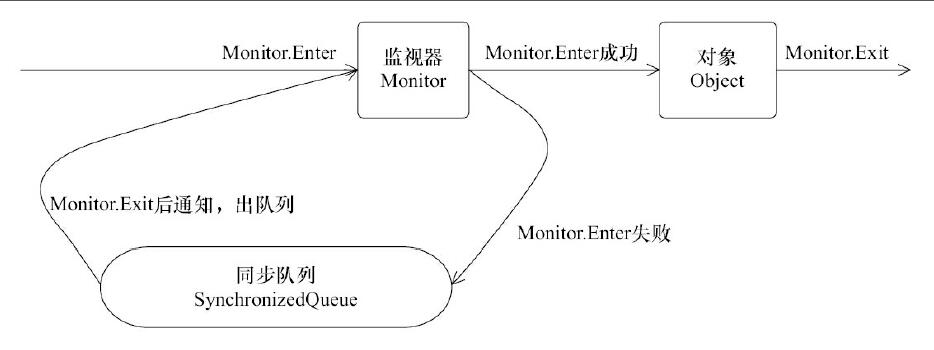
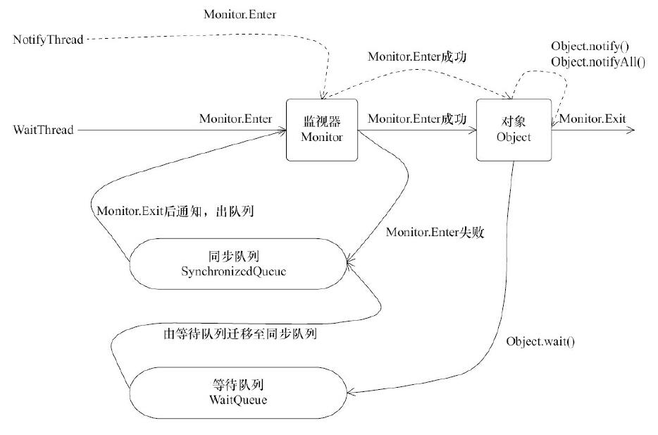

# 第4章 Java 并发编程基础

### 为什么要使用多线程
1. 更多的处理器核心
2. 更快的响应速度
3. 更好的编程模型

### 线程的状态
* NEW ： 初始化，线程被构建，但是还没有调用start()方法
* RUNNABLE ： 运行状态，java线程将操作系统中的就绪和运行两种状态笼统地称作“运行中”
* BLOCKED ： 阻塞状态，表示线程阻塞于锁
* WAITING ： 等待状态，表示线程进入等待状态，进入该状态表示当前线程需要等待其他线程做出一些特定的动作（通知或中断）
* TIME_WAITING ： 超时等待状态，该状态不同于WAITING，它是可以在指定时间自行返回的
* TERMINATED ： 终止状态，表示当前线程已经执行完毕

### Daemon线程
1. Daemon线程是一种支持型线程，因为它主要被用作程序中后台调度以及支持性工作。
2. 当一个Java虚拟机中不存在非Daemon线程时，Java虚拟机将会退出
3. 通过调用Thread.setDaemon(true)将线程设置为Daemon线程

### 启动和终止线程
1. 构造线程对象：由其parent线程来进行空间分配，而child线程继承了parent是否为Daemon、优先级和加载资源的contextClassLoader以及可继承的ThreadLocal，同时分配唯一ID标识。
2. 线程对象初始化完后调用start()方法就可以启动这个线程。
   > 线程start()方法的含义：当前线程（即parent线程）同步告知Java虚拟机，只要线程规划器空闲，应立即启动调用start()方法的线程。
3. 理解中断：中断可以理解为线程一个标识位属性，它表示一个运行中的线程是否被其它线程进行了中断操作
   * 其它线程通过调用该线程的interrupt()方法对其进行中断操作。
   * 线程自身通过isInterrupted()来进行判断是否被中断。
   * 调用静态方法Thread.interrupted()对当前线程的中断标识位进行复位。 
4. 过期的suspend()、resume()、stop()
   > suspend() 暂停线程;
   
   > resume() 恢复线程;
   
   > stop() 停止线程;
   
### 线程间通信
1. volatile和synchronized关键字
   > volatile 告知程序任何对该变量的访问均需要从共享内存中获取，而对它的改变必须同步刷新回共享内存，它能保证所有线程对变量访问的可见性。
   
   > synchronized 可以修饰方法或者以同步块的形式来进行使用，它主要确保多个线程在同一时刻，只能有一个线程处理方法或同步块中，它保证了线程对变量访问的可见性和排它性。
2. 对象、对象的监视器、同步队列和执行线程之间的关系


   任意线程对Object（Object由synchronized保护）的访问：
     1.  首先要获得Object的监视器。
     2.  如果获取失败，线程进入同步队列，线程状态变为BLOCKED。 
     3.  当访问Object的前驱（获得了锁的线程）释放了锁，则该释放操作唤醒阻塞在同步队列中的线程，使其重新尝试对监视器的获得。
3. 等待/通知机制
    > 等待/通知的相关方法  
    
    | 方法名称 | 描述 |  
    | :-: | :-: |   
    | notify() | 通知一个在对象上等待的线程，使其从wait()方法返回，而返回的前提是该线程获取到对象的锁 |   
    | notify() | 通知所有等待在该对象上的线程 |   
    | wait() | 调用该方法的线程进入WAITING状态，只有等待另外线程的通知或被中断才会返回，需要注意，<font color="red">调用wait()方法后，会释放对象的锁</font> |  
    | wait(long) | 超时等待一段时间，这里的参数时间是毫秒，也就是等待n毫秒，如果没有通知就超时返回 |   
    | wait(long, int) | 对于超时时间更细粒度的控制，可以达到纳秒 |   
  
    > WaitNotify运行过程
    
    
    
4. 等待/通知的经典范式
    > 等待方遵循如下规则
      1. 获取对象锁。
      2. 如果条件不满足，那么调用对象的wait()方法，被通知后仍要检查条件。
      3. 条件满足则执行对应逻辑。
     
    ```
        synchronized(对象){
            while(条件不满足){
                对象.wait();
            }
            对应的处理逻辑
        }
    ```
    > 通知方遵循如下原则
      1. 获得对象的锁。
      2. 改变条件。
      3. 通知所有等待在对象上的线程。 
      
    ```
        synchronized(对象) {
             改变条件
             对象.notifyAll();
        }
    ```
5. 管道输入/输出流
   > 管道输入/输出流和普通的文件输入/输出流或者网络输入/输出流不同之处在于，它主要
     用于线程之间的数据传输，而传输的媒介为内存。
   
   > 管道输入/输出流主要包括了如下4种具体实现：PipedOutputStream、PipedInputStream、
     PipedReader和PipedWriter，前两种面向字节，而后两种面向字符。
   
   _示列代码：fourth_chapter.Piped.java_
   
6. Thread.join()的使用
   > 如果线程A执行了Thread.join()，其语义是：当前线程A等待Thread线程终止后才从Thread.join()返回。
   1. Thread.join()
   2. Thread.join(long millis)
   3. Thread.join(long millis, int nanos)
 
   _示列代码：fourth_chapter.Join.java_
   
7. ThreadLocal的使用
   * ThreadLocal，即线程变量，是一个以ThreadLocal对象为键、任意对象为值的存储结构。
   * ThreadLocal被附带在线程上，也让就是说一个线程可以根据一个ThreadLocal对象查询到绑定在这个线程上的一个值。
   * 通过set()方法设置值，在当前线程下再通过get()方法获取原先的设置的值。
   
   _示列代码：fourth_chapter.Profiler.java_
   
### 线程应用实例
   

  
      


 [Go back to README](README.md)